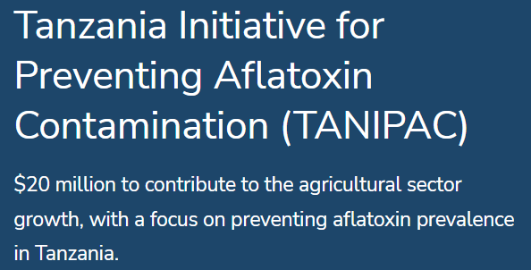






<link rel="stylesheet" href="/glyphicons/css/glyphicons.css" />

<table style="width:100%">
<col width="20%">
<col width="10">
<col >

<tr style="border-bottom:1pt solid #eee">
<td markdown="1">

</td>
<td></td>
<td markdown="1">
[**Tanzania Initiative for Preventing Aflatoxin Contamination**]

The project funded by [TANIPAC](https://www.gafspfund.org/projects/tanzania-initiative-preventing-aflatoxin-contamination-tanipac) with a focus on preventing aflatoxin prevalence in Tanzania.

<!-- </table> -->

