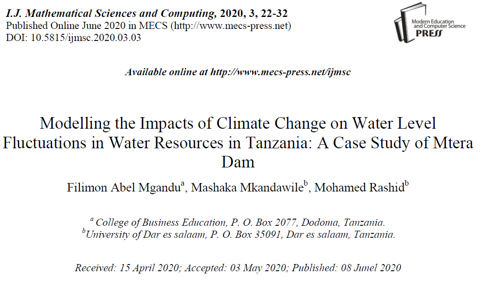
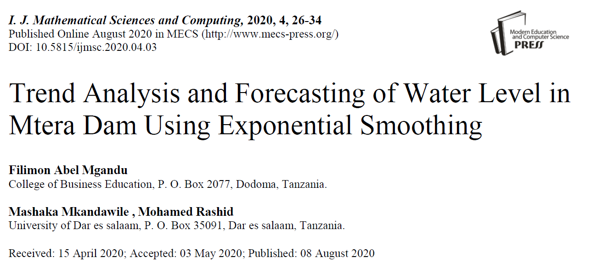






<link rel="stylesheet" href="/glyphicons/css/glyphicons.css">

<table style="width:100%">
<col width="20%">
<col width="10">
<col >

<!-- <tr height="50">
<td style="padding-left: 1px;
    padding-bottom: 3px;
    vertical-align: bottom;">
    <strong style="font-size: 25px;">2017</strong></td>
</tr> -->

<!-- <tr style="border-bottom:1pt solid #eee" >
<td markdown="1">
{:class="img-shadow"}
</td>
<td></td>
<td markdown="1">

<a href="/archive/research/videovec/"><b>Video Vectorization via Tetrahedral Remeshing</b></a>

<b>Chuan Wang</b>, Jie Zhu, Yanwen Guo, Wenping Wang

<i>IEEE Transactions on Image Processing, 2017</i>

<i>"converting a raster video into its vectorized version, with perservation of the video features"</i>

|| <em class="icon-home"></em> || [project page](/archive/research/videovec/) || <em class="icon-file"></em> || [paper](/archive/research/videovec/paper.pdf) || <em class="icon-film"></em> || [video demo](https://youtu.be/KmPdjB8f4ww) ||

</td> 
</tr> -->

<tr height="50">
<td style="padding-left: 1px;
    padding-bottom: 3px;
    vertical-align: bottom;">
    <strong style="font-size: 25px;">2021</strong></td>
</tr>

<tr style="border-bottom:1pt solid #eee" >
<td markdown="1">
<!-- {:class="img-shadow"} -->

</td>
<td></td>
<td markdown="1">

<b>Modelling the Impacts of Climate Change on Water Level Fluctuations in Water Resources in Tanzania: A Case Study of Mtera Dam</b>

 This study presents the modelling of impacts of climate change on water resources. Mtera dam in Tanzania was taken as a case study. Data for climate variables on four stations were obtained from Tanzania Meteorological Agency (TMA) while data for water level were obtained from Rufiji Basin Development Authority (RUBADA). The study aimed at doing regression analysis on all stations to analyze the impacts of change in climate variables on water level. Results show that rainfall was significant predictor of water level at Iringa and Dodoma while temperature and sunshine were significant at Mbeya station. Change in climate variables accounted for 37% of the fluctuations of water level in the dam. It was recommended that TANESCO should construct small dams on upper side of Mtera dam to harvest rain water during rainy season. In long run TANESCO should invest into alternative sources of energy.

<i>Accepted as a full paper at ICADL 2021</i>

|| <em class="icon-home"/> || [paper](https://www.mecs-press.org/ijmsc/ijmsc-v6-n3/IJMSC-V6-N3-3.pdf) ||

</td> 
</tr>

<tr style="border-bottom:1pt solid #eee" >
<td markdown="1">

</td>
<td></td>
<td markdown="1">

<b>Trend Analysis and Forecasting of Water Level in Mtera Dam Using Exponential Smoothing</b>

This study presents trend analysis and forecasting of water level in Mtera dam. Data for water level were obtained from Rufiji Basin Development Authority (RUBADA). The study analyzed trend of water level using time series regression while forecasting of water level in Mtera dam was done using Exponential smoothing. Results revealed that both maximum and minimum water level trends were decreasing. Forecasted values show that daily water level will be below 690 (m.a.s.l) which is the minimum level required for electricity generation on 2023. It was recommended that proper strategies should be taken by responsible authorities to reduce effects that may arise. Strategies my include constructing small dams on upper side of Mtera dam to harvest rain water during rainy season as reserves to be used on dry season. In long run Tanzania Electric Supply Company (TANESCO) should invest into alternative sources of energy.

<i>Accepted as a Poster and selected for spotlight talk at The 5th Black in AI Workshop (co-located with NeurIPS 2021)</i>

|| <em class="icon-home"/> || [paper](https://www.mecs-press.org/ijmsc/ijmsc-v6-n4/IJMSC-V6-N4-3.pdf)||

</td> 
</tr>

</table>

